# 03. System Design

## 1. System Design Overview

Agentic Testing Framework 的系統設計目標，是將需求分析與 domain model 轉換成可以實作的系統結構。

本系統以 Domain-Driven Design（DDD）為基礎，將核心概念拆分成不同 bounded contexts，並透過 class design、system architecture、activity flow 與 sequence design 描述各模組之間的互動方式。

系統主要支援以下功能：

1. Register Robot
2. Create Agent
3. Define Task
4. Create Workflow
5. Validate Workflow Compatibility
6. Run Workflow Test
7. Deploy Workflow to Agent
8. Evaluate Performance
9. Evaluate Energy Consumption

## 2. Functional Design

| Class                   | Method                     | Description                                                              |
| ----------------------- | -------------------------- | ------------------------------------------------------------------------ |
| Robot                   | register()                 | 註冊新的 Robot，包含名稱、類型、硬體規格、sensors、actuators 與 capabilities。                |
| Robot                   | checkProfile()             | 檢查 Robot 資料是否完整，並確認 capability 格式是否符合系統定義。                               |
| Agent                   | createFromRobot()          | 根據已註冊的 Robot 建立 Agent model，使不同 Robot 能以共同 Agent 形式被系統管理。                |
| Agent                   | getStatus()                | 回傳 Agent 目前狀態，例如 idle、testing、deployed、error。                            |
| Task                    | defineTask()               | 定義任務目標、所需 capabilities、限制條件與預期結果。                                        |
| Task                    | checkRequirement()         | 檢查 Task 的必要欄位與所需 capabilities 是否設定正確。                                    |
| Workflow                | createWorkflow()           | 將多個 Task 組合成一個 Workflow，並設定任務執行順序。                                       |
| Workflow                | checkWorkflow()            | 檢查 Workflow 是否包含 Task、Task 設定是否完整，以及任務順序是否合理。                            |
| CompatibilityValidation | validate()                 | 比對 Agent 的 capabilities 與 Workflow 中各 Task 的需求，確認 Agent 是否能執行該 Workflow。 |
| TestScenario            | setScenario()              | 設定 Workflow 測試時使用的測試情境與測試參數。                                             |
| TestRun                 | runTest()                  | 讓指定 Agent 在 Test Scenario 中執行 Workflow 測試。                               |
| TestRun                 | generateTestReport()       | 根據測試結果產生測試報告，包含成功或失敗狀態、錯誤原因與執行紀錄。                                        |
| Deployment              | deployWorkflow()           | 將已通過相容性驗證與測試的 Workflow 部署到指定 Agent。                                      |
| Deployment              | checkDeploymentStatus()    | 確認 Workflow 是否成功部署至 Agent，並記錄部署狀態。                                       |
| ExecutionRecord         | recordExecution()          | 記錄每次測試或部署的執行結果，包含執行時間、成功狀態、資源使用量與能源消耗。                                   |
| PerformanceEvaluation   | evaluatePerformance()      | 根據 Execution Record 評估 Agent 或 Workflow 的執行時間、成功率與資源使用量。                 |
| EnergyEvaluation        | evaluateEnergy()           | 根據 Execution Record 分析測試或部署過程中的能源消耗。                                     |
| EvaluationReport        | generateEvaluationReport() | 產生效能與能源評估報告，供使用者比較不同 Agent 或 Workflow 的表現。                               |

## 3. System Architecture

本系統依照主要責任切分為數個 context，每個 context 負責一組清楚的功能與 domain objects。

## 3.1 Architecture Contexts

| Context                          | Responsibility                                        | Main Classes                                              |
| -------------------------------- | ----------------------------------------------------- | --------------------------------------------------------- |
| Robot Management Context         | 管理 Robot 的註冊資料、硬體規格、sensors、actuators 與 capabilities。 | Robot, Sensor, Actuator, Capability                       |
| Agent Management Context         | 根據 Robot 建立 Agent，並管理 Agent 狀態與能力。                    | Agent, Robot, Capability                                  |
| Task and Workflow Context        | 定義 Task，並將多個 Task 組合成 Workflow。                       | Task, Workflow, Capability                                |
| Compatibility Validation Context | 檢查 Agent 是否具備 Workflow 所需能力。                          | CompatibilityValidation, Agent, Workflow                  |
| Testing Context                  | 執行 Workflow 測試並產生測試紀錄。                                | TestScenario, TestRun, ExecutionRecord                    |
| Deployment Context               | 將通過驗證與測試的 Workflow 部署到 Agent。                         | Deployment, Agent, Workflow                               |
| Evaluation Context               | 根據執行紀錄進行效能與能源評估。                                      | PerformanceEvaluation, EnergyEvaluation, EvaluationReport |

## 3.2 Architecture Diagram

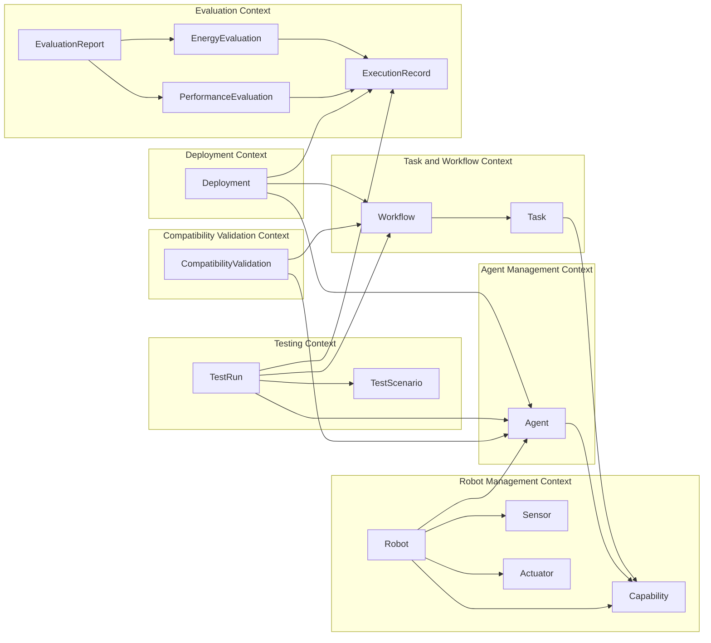

## 4. Class Design

## 4.1 Robot Management Context

### Robot

| Attribute    | Type             | Description             |
| ------------ | ---------------- | ----------------------- |
| robotId      | String           | Robot 的唯一識別值。           |
| name         | String           | Robot 名稱。               |
| type         | String           | Robot 類型。               |
| hardwareSpec | String           | Robot 的硬體規格。            |
| sensors      | List<Sensor>     | Robot 擁有的 sensors。      |
| actuators    | List<Actuator>   | Robot 擁有的 actuators。    |
| capabilities | List<Capability> | Robot 具備的 capabilities。 |

| Method         | Description            |
| -------------- | ---------------------- |
| register()     | 建立並儲存 Robot profile。   |
| checkProfile() | 檢查 Robot profile 是否完整。 |

### Sensor

| Attribute  | Type   | Description    |
| ---------- | ------ | -------------- |
| sensorId   | String | Sensor 的唯一識別值。 |
| name       | String | Sensor 名稱。     |
| sensorType | String | Sensor 類型。     |
| status     | String | Sensor 狀態。     |

| Method          | Description   |
| --------------- | ------------- |
| getSensorInfo() | 回傳 sensor 資訊。 |

### Actuator

| Attribute    | Type   | Description      |
| ------------ | ------ | ---------------- |
| actuatorId   | String | Actuator 的唯一識別值。 |
| name         | String | Actuator 名稱。     |
| actuatorType | String | Actuator 類型。     |
| status       | String | Actuator 狀態。     |

| Method            | Description     |
| ----------------- | --------------- |
| getActuatorInfo() | 回傳 actuator 資訊。 |

### Capability

| Attribute    | Type   | Description        |
| ------------ | ------ | ------------------ |
| capabilityId | String | Capability 的唯一識別值。 |
| name         | String | Capability 名稱。     |
| description  | String | Capability 說明。     |

| Method  | Description             |
| ------- | ----------------------- |
| match() | 比對 capability 是否符合任務需求。 |

## 4.2 Agent Management Context

### Agent

| Attribute    | Type             | Description      |
| ------------ | ---------------- | ---------------- |
| agentId      | String           | Agent 的唯一識別值。    |
| robot        | Robot            | Agent 對應的 Robot。 |
| state        | String           | Agent 目前狀態。      |
| capabilities | List<Capability> | Agent 可使用的能力。    |

| Method            | Description        |
| ----------------- | ------------------ |
| createFromRobot() | 根據 Robot 建立 Agent。 |
| getStatus()       | 回傳 Agent 狀態。       |

## 4.3 Task and Workflow Context

### Task

| Attribute            | Type             | Description          |
| -------------------- | ---------------- | -------------------- |
| taskId               | String           | Task 的唯一識別值。         |
| goal                 | String           | 任務目標。                |
| requiredCapabilities | List<Capability> | 執行任務所需 capabilities。 |
| constraints          | String           | 任務限制條件。              |
| expectedResult       | String           | 任務預期結果。              |

| Method             | Description     |
| ------------------ | --------------- |
| defineTask()       | 定義 Task。        |
| checkRequirement() | 檢查 Task 設定是否完整。 |

### Workflow

| Attribute   | Type       | Description           |
| ----------- | ---------- | --------------------- |
| workflowId  | String     | Workflow 的唯一識別值。      |
| name        | String     | Workflow 名稱。          |
| description | String     | Workflow 說明。          |
| tasks       | List<Task> | Workflow 包含的 Task 清單。 |
| status      | String     | Workflow 狀態。          |

| Method           | Description              |
| ---------------- | ------------------------ |
| createWorkflow() | 建立 Workflow。             |
| checkWorkflow()  | 檢查 Workflow 是否完整且任務順序合理。 |

## 4.4 Compatibility Validation Context

### CompatibilityValidation

| Attribute           | Type             | Description             |
| ------------------- | ---------------- | ----------------------- |
| validationId        | String           | 相容性驗證的唯一識別值。            |
| agent               | Agent            | 被驗證的 Agent。             |
| workflow            | Workflow         | 被驗證的 Workflow。          |
| isCompatible        | boolean          | 是否相容。                   |
| missingCapabilities | List<Capability> | Agent 缺少的 capabilities。 |
| checkedAt           | DateTime         | 驗證時間。                   |

| Method     | Description |
| ---------- | ----------- |
| validate() | 執行相容性驗證。    |

## 4.5 Testing Context

### TestScenario

| Attribute   | Type   | Description |
| ----------- | ------ | ----------- |
| scenarioId  | String | 測試情境的唯一識別值。 |
| name        | String | 測試情境名稱。     |
| environment | String | 測試環境。       |
| parameters  | String | 測試參數。       |

| Method        | Description |
| ------------- | ----------- |
| setScenario() | 設定測試情境與參數。  |

### TestRun

| Attribute | Type         | Description    |
| --------- | ------------ | -------------- |
| testRunId | String       | 測試執行的唯一識別值。    |
| agent     | Agent        | 執行測試的 Agent。   |
| workflow  | Workflow     | 被測試的 Workflow。 |
| scenario  | TestScenario | 使用的測試情境。       |
| status    | String       | 測試狀態。          |
| startedAt | DateTime     | 測試開始時間。        |
| endedAt   | DateTime     | 測試結束時間。        |

| Method               | Description     |
| -------------------- | --------------- |
| runTest()            | 執行 Workflow 測試。 |
| generateTestReport() | 產生測試報告。         |

## 4.6 Deployment Context

### Deployment

| Attribute    | Type     | Description    |
| ------------ | -------- | -------------- |
| deploymentId | String   | 部署的唯一識別值。      |
| agent        | Agent    | 目標 Agent。      |
| workflow     | Workflow | 被部署的 Workflow。 |
| status       | String   | 部署狀態。          |
| deployedAt   | DateTime | 部署時間。          |

| Method                  | Description          |
| ----------------------- | -------------------- |
| deployWorkflow()        | 部署 Workflow 至 Agent。 |
| checkDeploymentStatus() | 檢查部署狀態。              |

## 4.7 Evaluation Context

### ExecutionRecord

| Attribute         | Type     | Description                |
| ----------------- | -------- | -------------------------- |
| recordId          | String   | 執行紀錄的唯一識別值。                |
| sourceType        | String   | 紀錄來源，例如 test 或 deployment。 |
| startTime         | DateTime | 執行開始時間。                    |
| endTime           | DateTime | 執行結束時間。                    |
| success           | boolean  | 是否成功。                      |
| executionTime     | double   | 執行時間。                      |
| resourceUsage     | double   | 資源使用量。                     |
| energyConsumption | double   | 能源消耗。                      |
| errorMessage      | String   | 錯誤訊息。                      |

| Method            | Description |
| ----------------- | ----------- |
| recordExecution() | 記錄執行結果。     |

### PerformanceEvaluation

| Attribute               | Type                  | Description |
| ----------------------- | --------------------- | ----------- |
| performanceEvaluationId | String                | 效能評估的唯一識別值。 |
| records                 | List<ExecutionRecord> | 被評估的執行紀錄。   |
| averageExecutionTime    | double                | 平均執行時間。     |
| successRate             | double                | 成功率。        |
| resourceUsageSummary    | double                | 資源使用摘要。     |

| Method                | Description |
| --------------------- | ----------- |
| evaluatePerformance() | 評估效能表現。     |

### EnergyEvaluation

| Attribute                | Type                  | Description |
| ------------------------ | --------------------- | ----------- |
| energyEvaluationId       | String                | 能源評估的唯一識別值。 |
| records                  | List<ExecutionRecord> | 被評估的執行紀錄。   |
| totalEnergyConsumption   | double                | 總能源消耗。      |
| averageEnergyConsumption | double                | 平均能源消耗。     |
| energyEfficiency         | double                | 能源效率。       |

| Method           | Description |
| ---------------- | ----------- |
| evaluateEnergy() | 評估能源消耗。     |

### EvaluationReport

| Attribute             | Type                  | Description |
| --------------------- | --------------------- | ----------- |
| reportId              | String                | 評估報告的唯一識別值。 |
| performanceEvaluation | PerformanceEvaluation | 效能評估結果。     |
| energyEvaluation      | EnergyEvaluation      | 能源評估結果。     |
| generatedAt           | DateTime              | 報告產生時間。     |
| summary               | String                | 報告摘要。       |

| Method                     | Description |
| -------------------------- | ----------- |
| generateEvaluationReport() | 產生評估報告。     |

## 5. Class Diagram

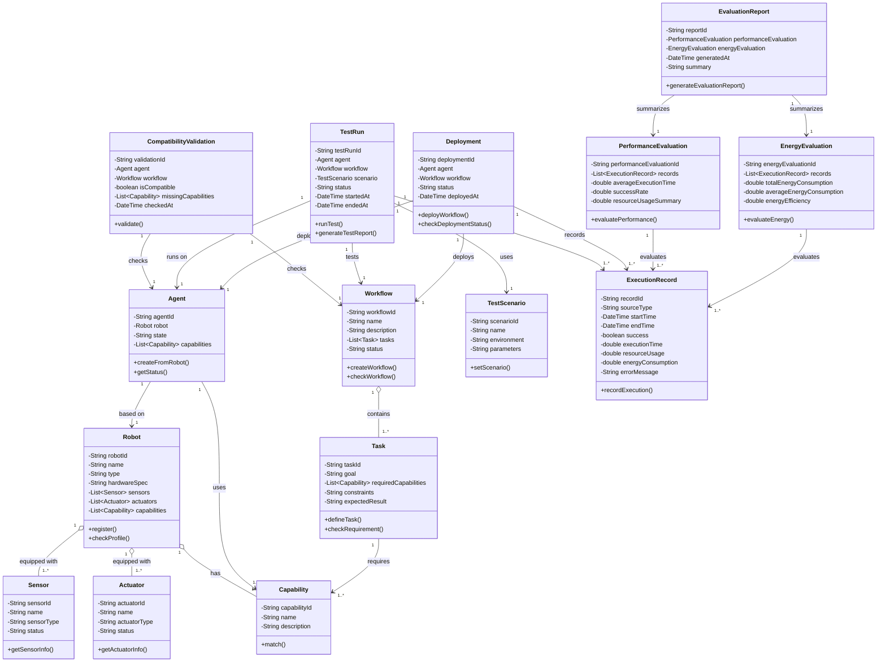

## 6. System Function Flow Design

| Use Case                              | Main Flow                                                                           |
| ------------------------------------- | ----------------------------------------------------------------------------------- |
| UC-01 Register Robot                  | Robotic Developer 輸入 Robot 資料，系統檢查 profile 與 capability 格式，正確後建立 Robot profile。     |
| UC-02 Create Agent                    | Robotic Developer 選擇已註冊 Robot，系統讀取 Robot capabilities，建立 Agent 並設定初始狀態。             |
| UC-03 Define Task                     | Robotic Developer 輸入 Task 設定，系統檢查必要欄位與 capability 定義，正確後儲存 Task。                    |
| UC-04 Create Workflow                 | Robotic Developer 建立 Workflow，加入多個 Task，設定順序，系統檢查 Workflow 完整性後儲存。                  |
| UC-05 Validate Workflow Compatibility | 系統讀取 Workflow requirements 與 Agent capabilities，進行比對並產生 validation result。          |
| UC-06 Run Workflow Test               | Tester 選擇已驗證 Workflow 與 Agent，設定測試參數，系統執行測試並產生測試報告。                                 |
| UC-07 Deploy Workflow to Agent        | Robotic Developer 選擇通過驗證與測試的 Workflow，系統部署至 Agent 並記錄部署狀態。                          |
| UC-08 Evaluate Performance            | Evaluator 選擇 ExecutionRecord，系統計算 execution time、success rate、resource usage 並產生報告。 |
| UC-09 Evaluate Energy Consumption     | Evaluator 選擇 ExecutionRecord，系統計算 energy consumption 與 energy efficiency 並產生報告。     |

## 7. System Execution Sequence Design

## 7.1 UC-01 Register Robot

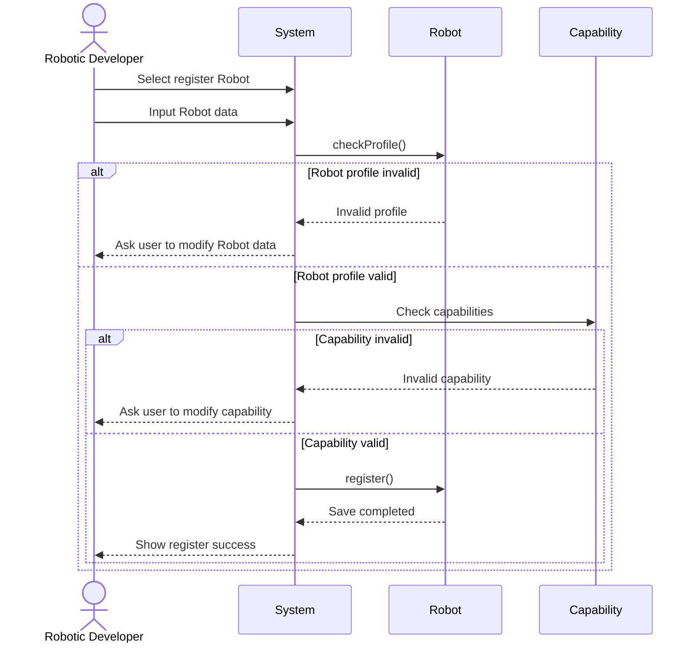

## 7.2 UC-02 Create Agent

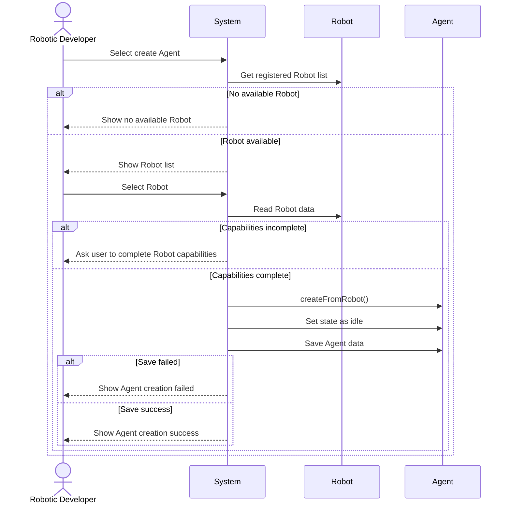

## 7.3 UC-03 Define Task

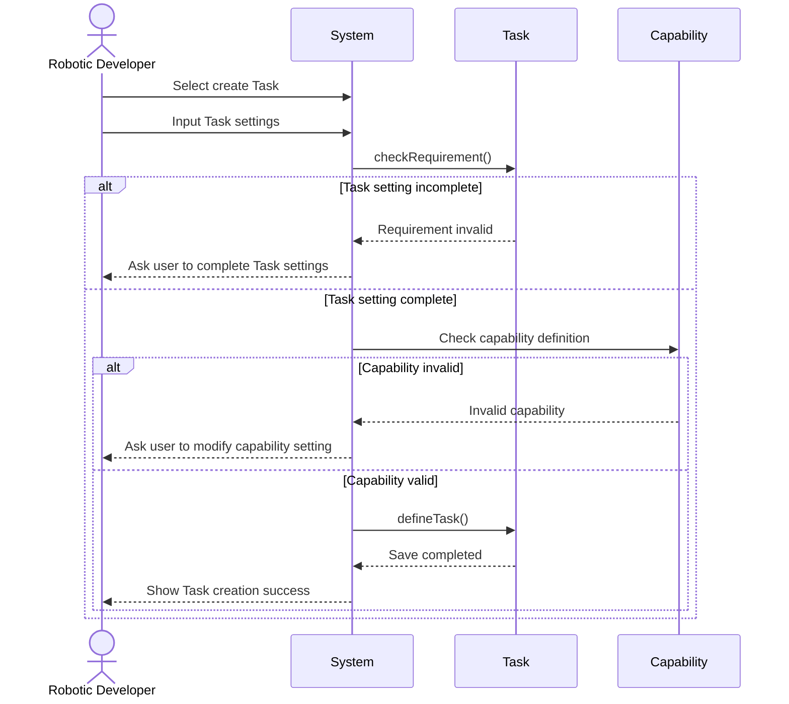

## 7.4 UC-04 Create Workflow

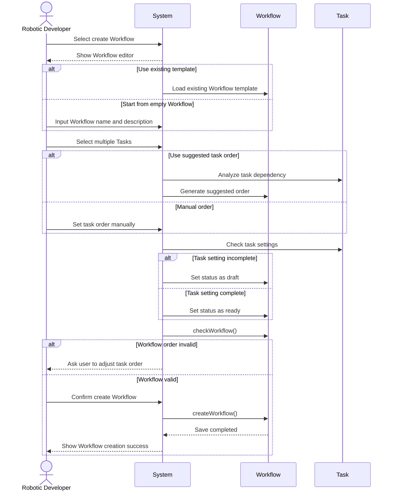

## 7.5 UC-05 Validate Workflow Compatibility

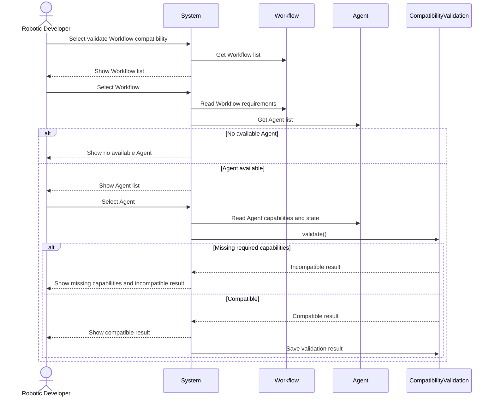

## 7.6 UC-06 Run Workflow Test

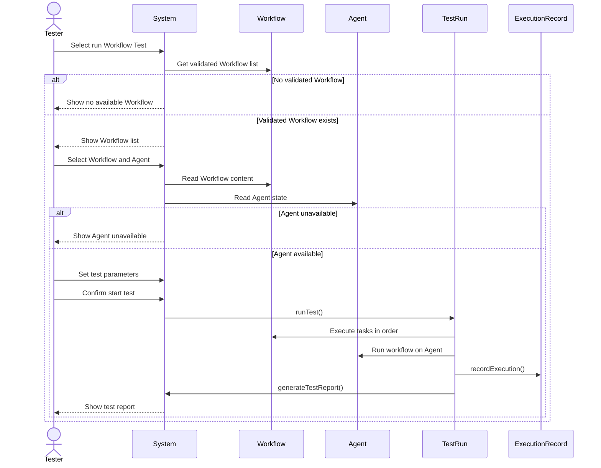

## 7.7 UC-07 Deploy Workflow to Agent

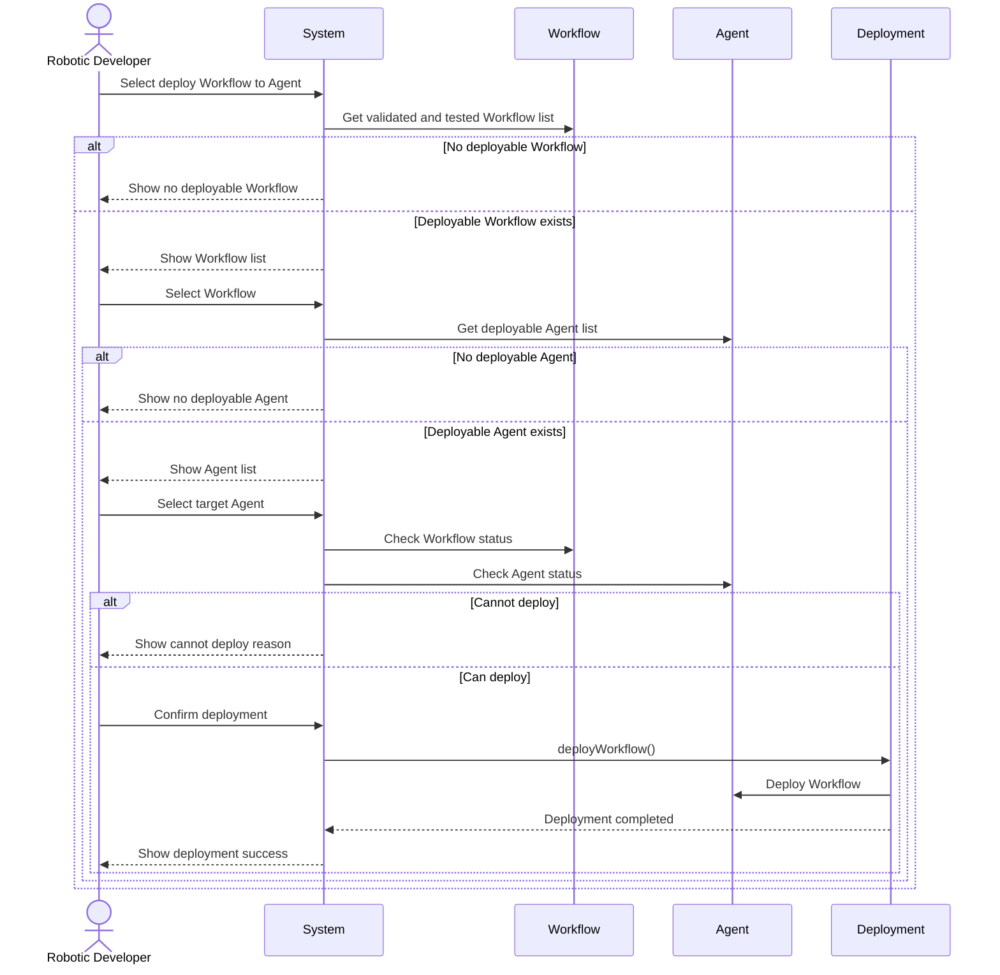

## 7.8 UC-08 Evaluate Performance

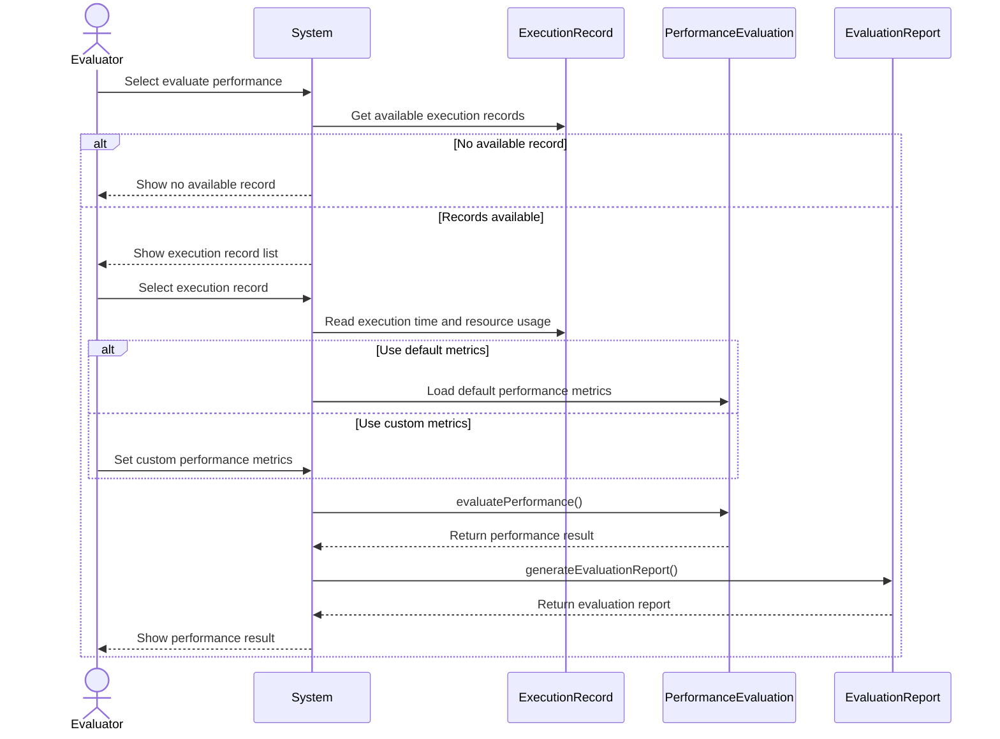

## 7.9 UC-09 Evaluate Energy Consumption

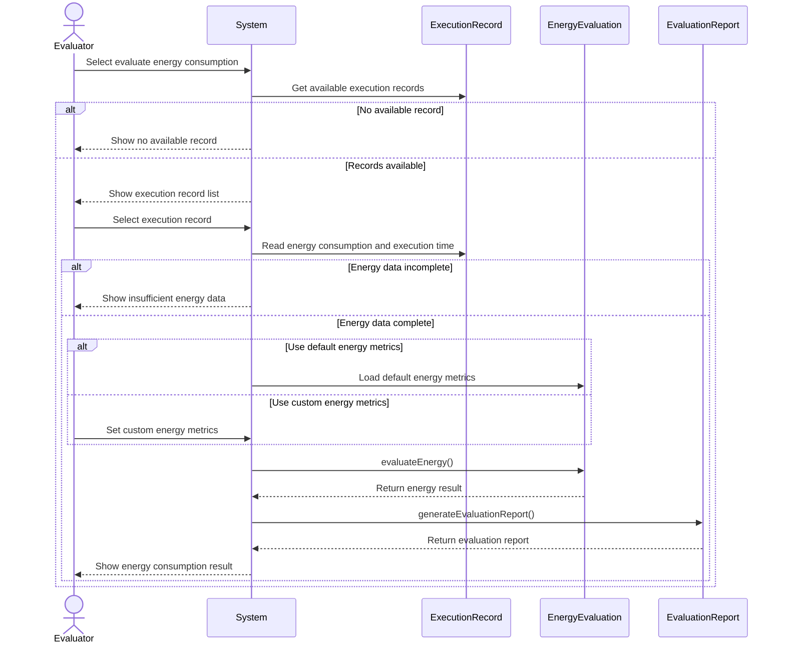

## 8. Design Notes

## 8.1 DDD Design Perspective

在 DDD 的角度下，本系統的主要 Entity 包含：

* Robot
* Agent
* Task
* Workflow
* TestRun
* Deployment
* ExecutionRecord
* PerformanceEvaluation
* EnergyEvaluation
* EvaluationReport

Capability 在本系統中主要用於能力比對，因此可以視為 Value Object。CompatibilityValidation 負責處理 Agent capabilities 與 Workflow requirements 的跨物件規則，因此可以視為 Domain Service 或具有紀錄性質的 Entity。

## 8.2 Main Design Decisions

1. Robot 與 Agent 分離，避免系統直接依賴不同 Robot 的硬體差異。
2. Task 與 Workflow 分離，使單一 Task 可以被多個 Workflow 重複使用。
3. CompatibilityValidation 獨立成一個類別，讓相容性比對邏輯集中管理。
4. TestRun 與 Deployment 都會產生 ExecutionRecord，方便後續 Evaluation 使用。
5. PerformanceEvaluation 與 EnergyEvaluation 分離，讓效能與能源消耗可以獨立分析。
6. EvaluationReport 整合評估結果，提供使用者比較不同 Agent 或 Workflow 的依據。

## 9. Summary

本系統設計將 Agentic Testing Framework 拆分為 Robot Management、Agent Management、Task and Workflow、Compatibility Validation、Testing、Deployment 與 Evaluation 等主要模組。

透過這樣的設計，系統可以支援從 Robot 註冊、Agent 建立、Task 定義、Workflow 建立，到相容性驗證、測試、部署與評估的完整流程。Class Diagram 描述了核心類別之間的資料關係，Sequence Design 則描述了每個 Use Case 的執行互動方式。

此設計能讓系統在後續實作時維持清楚的架構，也符合 DDD 將核心業務邏輯集中於 domain model 的設計方向。