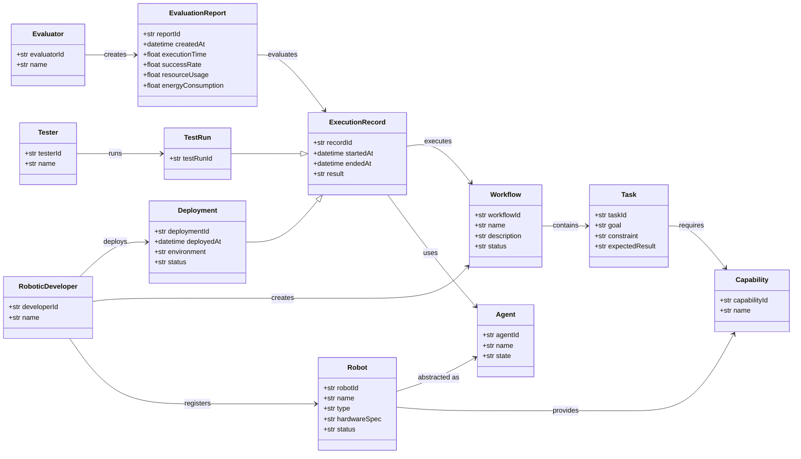

```mermaid
classDiagram
direction LR

class RoboticDeveloper {
    +str developerId
    +str name
}

class Tester {
    +str testerId
    +str name
}

class Evaluator {
    +str evaluatorId
    +str name
}

class Robot {
    +str robotId
    +str name
    +str type
    +str hardwareSpec
    +str status
}

class Agent {
    +str agentId
    +str name
    +str state
}

class Capability {
    +str capabilityId
    +str name
}

class Task {
    +str taskId
    +str goal
    +str constraint
    +str expectedResult
}

class Workflow {
    +str workflowId
    +str name
    +str description
    +str status
}

class ExecutionRecord {
    +str recordId
    +datetime startedAt
    +datetime endedAt
    +str result
}

class TestRun {
    +str testRunId
}

class Deployment {
    +str deploymentId
    +datetime deployedAt
    +str environment
    +str status
}

class EvaluationReport {
    +str reportId
    +datetime createdAt
    +float executionTime
    +float successRate
    +float resourceUsage
    +float energyConsumption
}

RoboticDeveloper --> Robot : registers
Robot --> Capability : provides
Robot --> Agent : abstracted as

RoboticDeveloper --> Workflow : creates
Workflow --> Task : contains
Task --> Capability : requires

Tester --> TestRun : runs
RoboticDeveloper --> Deployment : deploys

TestRun --|> ExecutionRecord
Deployment --|> ExecutionRecord

ExecutionRecord --> Agent : uses
ExecutionRecord --> Workflow : executes

Evaluator --> EvaluationReport : creates
EvaluationReport --> ExecutionRecord : evaluates
```