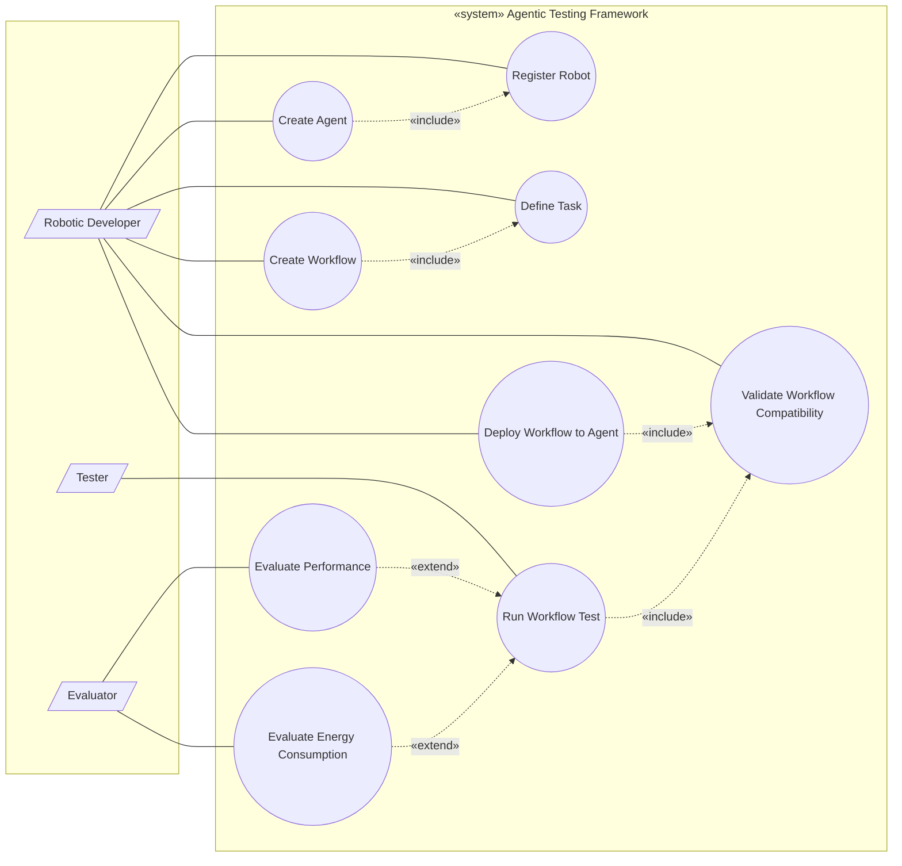

```mermaid
flowchart LR
subgraph Actors[" "]
    direction TB
    Developer[/"Robotic Developer"/]
    Tester[/"Tester"/]
    Evaluator[/"Evaluator"/]
end

subgraph System["«system» Agentic Testing Framework"]
    direction TB

    UC1(("Register Robot"))
    UC2(("Create Agent"))
    UC3(("Define Task"))
    UC4(("Create Workflow"))
    UC5(("Validate Workflow Compatibility"))
    UC6(("Run Workflow Test"))
    UC7(("Deploy Workflow to Agent"))
    UC8(("Evaluate Performance"))
    UC9(("Evaluate Energy Consumption"))
end

Developer --- UC1
Developer --- UC2
Developer --- UC3
Developer --- UC4
Developer --- UC5
Developer --- UC7

Tester --- UC6

Evaluator --- UC8
Evaluator --- UC9

UC2 -. "«include»" .-> UC1
UC4 -. "«include»" .-> UC3

UC6 -. "«include»" .-> UC5
UC7 -. "«include»" .-> UC5

UC8 -. "«extend»" .-> UC6
UC9 -. "«extend»" .-> UC6
```